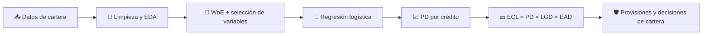
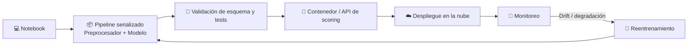

# 💳 ECL_Credit_Loss
### Modelo de Pérdida Crediticia Esperada (Expected Credit Loss) con Machine Learning y MLOps


> 🎯 **Resumen:** pipeline end-to-end de **riesgo de crédito** sobre **+2.1 millones de créditos** de Lending Club: limpieza, análisis, selección de variables con **WoE/IV**, un modelo de probabilidad de default (PD) con **AUC 0.71 / Gini 0.41 / KS 0.30 en test** y un preprocesador `fit/transform` listo para producción.

---

## 📌 Tabla de contenidos

1. [🧭 ¿De qué trata el proyecto?](#-de-qué-trata-el-proyecto)
2. [🏦 Contexto: evaluación de carteras y riesgo de crédito](#-contexto-evaluación-de-carteras-y-riesgo-de-crédito)
3. [📐 ¿Qué es el ECL y cuál es su fórmula?](#-qué-es-el-ecl-y-cuál-es-su-fórmula)
4. [📊 Dataset](#-dataset)
5. [🧮 WoE e IV en pocas palabras](#-woe-e-iv-en-pocas-palabras)
6. [🔬 Desarrollo del notebook](#-desarrollo-del-notebook)
7. [⚙️ Preprocesador y WoE Encoder](#️-preprocesador-y-woe-encoder)
8. [🏆 Resultados del modelo](#-resultados-del-modelo)
9. [🚀 Despliegue con MLOps](#-despliegue-con-mlops)
10. [🛠️ Stack tecnológico](#️-stack-tecnológico)
11. [🗺️ Roadmap](#️-roadmap)
12. [👤 Autor](#-autor)

---

## 🧭 ¿De qué trata el proyecto?

**ECL_Credit_Loss** construye un modelo de riesgo crediticio que estima la probabilidad de que un cliente caiga en **default** y sienta la base para calcular la **pérdida esperada** de una cartera de créditos.

Es el tipo de problema que resuelven a diario las áreas de **Riesgos**, **Cobranzas** y **Finanzas** de bancos, cooperativas, fintechs y emisores de crédito de consumo.

**Enfoque del proyecto**

- 🧹 Tratamiento de valores faltantes con criterio de negocio: un nulo en una variable de conteo significa "sin actividad".
- 📉 Análisis exploratorio de las variables frente a la variable objetivo (default).
- 🧮 Selección de variables con **Information Value (IV)**, correlación de Spearman y **VIF**.
- 🔁 Categorización y transformación con **Weight of Evidence (WoE)**, estándar en scorecards de crédito.
- 🤖 Modelado con **regresión logística**, por su interpretabilidad y aceptación regulatoria.
- 🛡️ Control de **data leakage**: split antes de transformar y exclusión de variables posteriores al desembolso.
- 📦 Feature engineering encapsulado en clases reutilizables para **MLOps**.

---

## 🏦 Contexto: evaluación de carteras y riesgo de crédito

Una **cartera de créditos** es el conjunto de préstamos que una institución tiene vigentes. Gestionarla implica responder preguntas como:

| Pregunta de negocio | Herramienta |
|---|---|
| ¿Qué clientes tienen mayor probabilidad de no pagar? | Modelo de **PD** (scoring) |
| ¿Cuánto se pierde si el cliente no paga? | **LGD** (Loss Given Default) |
| ¿Cuánta exposición hay al momento del default? | **EAD** (Exposure at Default) |
| ¿Cuánto debo provisionar para cubrir pérdidas? | **ECL** (provisiones) |
| ¿Dónde otorgar más o menos crédito? | Segmentación y políticas de originación |

**Casos de uso en evaluación de carteras**

- ✅ **Originación:** aprobar, rechazar o fijar condiciones de un crédito nuevo.
- 📊 **Gestión de cartera:** identificar segmentos que se deterioran antes de que entren en mora.
- 🛡️ **Provisiones regulatorias:** estimar reservas bajo marcos como **IFRS 9** y **Basilea**.
- 💰 **Pricing por riesgo:** ajustar tasas según el perfil del cliente.
- 📞 **Cobranza:** priorizar esfuerzos sobre las cuentas con mayor riesgo.

---

## 📐 ¿Qué es el ECL y cuál es su fórmula?

El **Expected Credit Loss (ECL)** o *Pérdida Crediticia Esperada* es la estimación, ponderada por probabilidad, de las pérdidas que una institución espera tener por créditos que no se paguen. Es el corazón del modelo de provisiones de **IFRS 9**, que obliga a reconocer pérdidas **esperadas** y no solo las ya ocurridas.

### 🧮 Fórmula

```
ECL = PD × LGD × EAD
```

| Componente | Significado | Rango típico |
|---|---|---|
| **PD** (*Probability of Default*) | Probabilidad de que el cliente incumpla en un horizonte dado (12 meses o toda la vida del crédito) | 0 – 100 % |
| **LGD** (*Loss Given Default*) | Porcentaje de la exposición que se pierde si hay default, después de recuperaciones | 0 – 100 % |
| **EAD** (*Exposure at Default*) | Monto expuesto al momento del default | Valor monetario |

Para horizontes de múltiples periodos, el ECL se descuenta a valor presente:

```
ECL = Σ  PD_t × LGD_t × EAD_t × DF_t
      t
```

donde `DF_t` es el factor de descuento del periodo `t` (normalmente la tasa efectiva del crédito).

### 🧩 Ejemplo ilustrativo

| PD | LGD | EAD | **ECL** |
|---|---|---|---|
| 5 % | 45 % | $10,000 | 0.05 × 0.45 × 10,000 = **$225** |

### 🎯 ¿Dónde encaja este proyecto?

Este proyecto se centra en el componente **PD**, el más intensivo en modelado estadístico. La salida del modelo (probabilidad de default por crédito) es el insumo directo para completar el cálculo del ECL al combinarse con LGD y EAD.



---

## 📊 Dataset

| Característica | Detalle |
|---|---|
| 🗂️ Fuente | [Lending Club Loan Data (cleared)](https://www.kaggle.com/datasets/db0boy/lending-club-loan-data-cleared/data), Kaggle |
| 📦 Registros totales | **2,139,643** |
| 🎯 Variable objetivo | `y` (binaria: default / no default) |
| ⚖️ Balance de clases | ~**13 %** de casos positivos (desbalanceado) |
| 🧬 Tipo de variables | Financieras, de historial crediticio y de morosidad |
| 🔀 Split | Estratificado por `y`, `test_size=0.2`, `random_state=42` |
| 🏋️ Train / 🧪 Test | 1,711,714 / 427,929 filas (13.07 % de default en ambos) |

**Supuesto temporal:** las variables tipo `_6mths`, `_12mths` y `_24mths` se miden hacia atrás desde la **fecha de originación** del crédito.

---

## 🧮 WoE e IV en pocas palabras

Son dos métricas clásicas de los **scorecards de crédito**. Se calculan dividiendo cada variable en grupos (*bins*) y comparando, dentro de cada grupo, cuántos clientes pagaron y cuántos cayeron en default.

### 🔁 WoE (Weight of Evidence)

Mide qué tan "bueno" o "malo" es un grupo de clientes respecto al total:

```
WoE = ln( %buenos del grupo / %malos del grupo )
```

| WoE del grupo | Lectura |
|---|---|
| **Positivo** | Predominan los buenos pagadores |
| **Cercano a 0** | Grupo neutro |
| **Negativo** | Predominan los clientes en default |

📌 **Ejemplo ilustrativo:** si un tramo de `interest_rate` concentra el 10 % de los buenos y el 25 % de los malos, su WoE es ln(0.10 / 0.25) ≈ **-0.92**, es decir, un grupo de mayor riesgo.

**¿Para qué se usa?** Cada valor original se reemplaza por el WoE de su grupo. Así se obtiene una relación monótona con el riesgo, se tratan de forma uniforme los nulos, outliers y centinelas, y las variables quedan listas para una regresión logística interpretable.

### 📏 IV (Information Value)

Resume el poder predictivo de **toda una variable** sumando el aporte de cada grupo:

```
IV = Σ ( %buenos − %malos ) × WoE
```

Cuanto mayor es el IV, mejor separa la variable a buenos y malos pagadores. En este proyecto se usó para **ranking y filtrado** de variables (umbral IV > 0.01). Sus rangos de interpretación están en la guía de la sección de desarrollo.

---

## 🔬 Desarrollo del notebook

### 1️⃣ Split antes de transformar

El dataset se divide en train y test **antes** de cualquier transformación, para evitar *data leakage*. Todo el análisis exploratorio y los parámetros aprendidos salen únicamente de train.

### 2️⃣ Tratamiento de valores faltantes

El criterio fue **no inventar actividad** que probablemente nunca ocurrió:

| Grupo de variables | Tratamiento | Razonamiento |
|---|---|---|
| `mths_since_*` (4 variables) | Flag `nunca_*` + centinela **999** | Si nunca ocurrió, equivale a "hace muchísimo tiempo" |
| `num_*` (6 variables de conteo) | Imputación con **0** | Lo más razonable es que nunca hubo actividad; una media implicaría actividad y debilitaría el coeficiente |
| `max_bal_owed` | **Mediana** | Distribución más asimétrica |
| `bal_to_cred_lim` | **Media** | Distribución más simétrica |
| `emp_title` | Flag `sin_emp_title` y se elimina la columna | Un nulo puede significar desempleo |
| `emp_length` | Se convierte a `emp_length_num` (nulos en 0) | Numérica es más útil que categórica |

### 3️⃣ Tratamiento de outliers

| Grupo | Decisión |
|---|---|
| Variables con centinela 999 y conteos de morosidad | Sin modificar, para no perder información |
| 7 variables continuas casi simétricas (`interest_rate`, `monthly_payment`, `funded_amnt`, etc.) | **Capping 1.5 × IQR** |
| `annual_income` > $1M (574 registros) | Prueba z de proporciones (p = 0.003): hay diferencia, pero se conservan limitados a $1M |

### 4️⃣ EDA frente al default y control de leakage

- 📦 Boxplots de las variables numéricas separados por `y`.
- 🔎 Se detectó que el centinela 999 de `mths_since_recent_bankcard_delinq` concentra ~87 % de `y=0`, lo que corrige la lectura engañosa del boxplot.
- 📆 Se verificó que no hay saltos abruptos por año de emisión.
- 🚫 Se excluyeron variables posteriores al desembolso (`princ_rec`, `interest_rec`, `late_fees_rec`, entre otras) con un `assert` de seguridad.

### 5️⃣ Selección de variables

| Etapa | Criterio | Resultado |
|---|---|---|
| **WoE / IV** | Conservar variables con IV > 0.01 | 17 variables (la más fuerte: `interest_rate`, IV = 0.446) |
| **Correlación de Spearman** | Eliminar la de menor IV en pares con \|ρ\| > 0.7 | Salieron 4 variables redundantes |
| **VIF** | Revisar multicolinealidad | **VIF máximo = 1.97** ✅ |
| **Variables adicionales** | Evaluar con IV | Se suman `loan_term_months` (0.073) y `credit_history_length` (0.011); se descartan `emp_length_num` y `region_code` |

🏁 **Set final: 15 variables**, con **VIF máximo de 1.98**.

### 📚 Guía de interpretación del IV

| IV | Poder predictivo |
|---|---|
| < 0.02 | Débil / no útil |
| 0.02 – 0.1 | Débil a medio |
| 0.1 – 0.3 | Medio |
| 0.3 – 0.5 | Fuerte |
| > 0.5 | Muy fuerte (revisar posible fuga de información) |

---

## ⚙️ Preprocesador y WoE Encoder

El feature engineering se estructuró como clases con interfaz **`fit` / `transform`**, de modo que el mismo código corra en entrenamiento y en producción.

### 🔁 `WOEEncoderV2`

Calcula el **Weight of Evidence** de cada grupo a partir de train y lo aplica igual a train y test:

```
WoE = ln( %buenos / %malos )      # con suavizado de Laplace
```

- Se ajusta **solo con train** para evitar *data leakage*.
- Bins manuales para conteos y centinelas, **deciles** para variables continuas y categorías directas para `loan_term_months`.
- Soporta variables categóricas y aplica un valor de respaldo (WoE = 0) ante valores fuera de rango. En test **nunca se activó**: todos los valores cayeron en bins reales de train.

### 🧱 `PreprocesadorECL`

| Tipo | Qué hace |
|---|---|
| 🔒 **Tipo A (fijas)** | `credit_history_length`, nulos → 999 / 0 según la variable, límite de `annual_income` en $1M |
| 📚 **Tipo B (aprendidas en train)** | Mediana de `max_bal_owed`, media de `bal_to_cred_lim` y mapas WoE |

```python
prep = PreprocesadorECL()
prep.fit(train_df)                  # aprende parámetros solo con train

train_woe = prep.transform(train_df)
test_woe  = prep.transform(test_df) # test crudo, mismas transformaciones

features = prep.get_features_finales()
X_train, y_train = train_woe[features], train_woe['y']
X_test,  y_test  = test_woe[features],  test_woe['y']
```

✅ **Verificaciones:** sin `NaN` ni `Inf` en train y test, shapes `(1,711,714 × 15)` y `(427,929 × 15)`, y misma tasa de default en ambos conjuntos.

---

## 🏆 Resultados del modelo

```python
LogisticRegression(class_weight='balanced', max_iter=1000, random_state=42)
```

| Métrica | Train | Test |
|---|---|---|
| **AUC-ROC** | 0.7056 | **0.7065** |
| **Gini** | 0.4112 | **0.4129** |
| **KS** | 0.2981 | **0.3005** |

- ✅ **Sin sobreajuste:** las métricas de train y test son prácticamente idénticas.
- ✅ **Coeficientes coherentes:** 14 de 15 variables tienen el signo esperado (negativo, porque el WoE se define como `ln(%buenos/%malos)`). La variable con mayor peso es `interest_rate` (-0.82).
- 🔍 **Punto a revisar:** `num_open_trades_in_6mths` tiene un coeficiente positivo muy pequeño (+0.04), candidato a reagrupar sus bins.

### 📅 Estabilidad temporal

AUC en test por año de emisión: de **0.64 en 2007** a **0.70 en 2018**, con mejora gradual en los años recientes.

---

## 🚀 Despliegue con MLOps

> 📝 Esta sección describe la arquitectura objetivo. El preprocesador ya está diseñado con interfaz `fit/transform` justamente para facilitar estos pasos.



| Etapa | Qué incluye |
|---|---|
| 📦 **Empaquetado** | Preprocesador + modelo en un único artefacto serializado (`joblib`) |
| 🧪 **Validación** | Chequeo de columnas, tipos y rangos antes de `transform` |
| 🗂️ **Versionado** | Control de versiones de código, datos, preprocesador y modelo |
| 🌐 **Servicio** | API de scoring (por ejemplo FastAPI) en contenedor Docker |
| ☁️ **Plataforma** | Evaluación de **AWS SageMaker** frente a **Azure Machine Learning** |
| 📡 **Monitoreo** | **PSI** para drift de variables, AUC/KS en producción, calibración de PD |
| 🔄 **Reentrenamiento** | Disparado por drift o caída de desempeño |

---

## 🛠️ Stack tecnológico

| Área | Herramientas |
|---|---|
| 🐍 Lenguaje | Python, SQL |
| 📊 Análisis | pandas, NumPy, SciPy, statsmodels |
| 📈 Visualización | Matplotlib, Seaborn |
| 🤖 Modelado | scikit-learn (regresión logística) |
| 🧮 Riesgo de crédito | WoE, IV, VIF, Spearman |
| 📥 Datos | Kaggle (`kagglehub`) |
| 🚀 MLOps | joblib, Docker, FastAPI, SageMaker / Azure ML |
| 📓 Entorno | Jupyter Notebook |

---

## 🗺️ Roadmap

- [x] Split estratificado y control de data leakage
- [x] Tratamiento de valores faltantes y outliers
- [x] EDA frente a la variable objetivo
- [x] WoE / IV, correlación (Spearman) y VIF
- [x] `WOEEncoderV2` y `PreprocesadorECL`
- [x] Entrenamiento de la regresión logística
- [x] Evaluación: AUC-ROC, Gini, KS y AUC por año
- [ ] Revisar `num_open_trades_in_6mths` (signo del coeficiente)
- [ ] Incorporar el capping IQR dentro del preprocesador
- [ ] Calibración de PD y cálculo de ECL (PD × LGD × EAD)
- [ ] Empaquetado y despliegue con MLOps
- [ ] Monitoreo y reentrenamiento

---

## 👤 Autor

**Alex** · 🇪🇨 Ecuador
🤖 AI / Data Scientist / Blockchain Developer · MLOps · Analytics
🐍 Python · SQL · Electrónica

📫s **Contacto:** _agrega aquí tu LinkedIn, GitHub y correo_

---

⭐ *Si este proyecto te resulta útil, no dudes en dejar una estrella en el repositorio.*