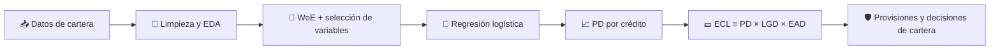

# 💳 ECL_Credit_Loss
### Modelo de Pérdida Crediticia Esperada (Expected Credit Loss) con Machine Learning y MLOps


> 🎯 **Resumen:** pipeline end-to-end de **riesgo de crédito** sobre una cartera de **+2.1 millones de créditos**: desde la limpieza y el análisis estadístico hasta un modelo de probabilidad de default (PD) interpretable y un preprocesador `fit/transform` listo para producción.

---

## 📌 Tabla de contenidos

1. [🧭 ¿De qué trata el proyecto?](#-de-qué-trata-el-proyecto)
2. [🏦 Contexto: evaluación de carteras y riesgo de crédito](#-contexto-evaluación-de-carteras-y-riesgo-de-crédito)
3. [📐 ¿Qué es el ECL y cuál es su fórmula?](#-qué-es-el-ecl-y-cuál-es-su-fórmula)
4. [📊 Dataset](#-dataset)
5. [🔬 Desarrollo del notebook](#-desarrollo-del-notebook)
6. [⚙️ Preprocesador y WoE Encoder](#️-preprocesador-y-woe-encoder)
7. [🚀 Despliegue con MLOps](#-despliegue-con-mlops)
8. [🛠️ Stack tecnológico](#️-stack-tecnológico)
9. [🗺️ Roadmap](#️-roadmap)
10. [👤 Autor](#-autor)

---

## 🧭 ¿De qué trata el proyecto?

**ECL_Credit_Loss** construye un modelo de riesgo crediticio que estima la probabilidad de que un cliente caiga en **default** y sienta la base para calcular la **pérdida esperada** de una cartera de créditos.

Es el tipo de problema que resuelven a diario las áreas de **Riesgos**, **Cobranzas** y **Finanzas** de bancos, cooperativas, fintechs y emisores de crédito de consumo.

**Enfoque del proyecto**

- 🧹 Limpieza e imputación de datos con criterios justificados estadísticamente.
- 📉 Análisis exploratorio y pruebas de hipótesis (ANOVA, chi-cuadrado, correlación).
- 🧮 Selección de variables con **Information Value (IV)**, correlación de Spearman y **VIF**.
- 🔁 Transformación con **Weight of Evidence (WoE)**, estándar en scorecards de crédito.
- 🤖 Modelado con **regresión logística**, por su interpretabilidad y aceptación regulatoria.
- 📦 Feature engineering encapsulado en clases reutilizables para **MLOps**.

---

## 🏦 Contexto: evaluación de carteras y riesgo de crédito

Una **cartera de créditos** es el conjunto de préstamos que una institución tiene vigentes. Gestionarla implica responder preguntas como:

| Pregunta de negocio | Herramienta |
|---|---|
| ¿Qué clientes tienen mayor probabilidad de no pagar? | Modelo de **PD** (scoring) |
| ¿Cuánto se pierde si el cliente no paga? | **LGD** (Loss Given Default) |
| ¿Cuánta exposición hay al momento del default? | **EAD** (Exposure at Default) |
| ¿Cuánto debo provisionar para cubrir pérdidas? | **ECL** (provisiones) |
| ¿Dónde otorgar más o menos crédito? | Segmentación y políticas de originación |

**Casos de uso en evaluación de carteras**

- ✅ **Originación:** aprobar, rechazar o fijar condiciones de un crédito nuevo.
- 📊 **Gestión de cartera:** identificar segmentos que se deterioran antes de que entren en mora.
- 🛡️ **Provisiones regulatorias:** estimar reservas bajo marcos como **IFRS 9** y **Basilea**.
- 💰 **Pricing por riesgo:** ajustar tasas según el perfil del cliente.
- 📞 **Cobranza:** priorizar esfuerzos sobre las cuentas con mayor riesgo.

---

## 📐 ¿Qué es el ECL y cuál es su fórmula?

El **Expected Credit Loss (ECL)** o *Pérdida Crediticia Esperada* es la estimación, ponderada por probabilidad, de las pérdidas que una institución espera tener por créditos que no se paguen. Es el corazón del modelo de provisiones de **IFRS 9**, que obliga a reconocer pérdidas **esperadas** y no solo las ya ocurridas.

### 🧮 Fórmula

```
ECL = PD × LGD × EAD
```

| Componente | Significado | Rango típico |
|---|---|---|
| **PD** (*Probability of Default*) | Probabilidad de que el cliente incumpla en un horizonte dado (12 meses o toda la vida del crédito) | 0 – 100 % |
| **LGD** (*Loss Given Default*) | Porcentaje de la exposición que se pierde si hay default, después de recuperaciones | 0 – 100 % |
| **EAD** (*Exposure at Default*) | Monto expuesto al momento del default | Valor monetario |

Para horizontes de múltiples periodos, el ECL se descuenta a valor presente:

```
ECL = Σ  PD_t × LGD_t × EAD_t × DF_t
      t
```

donde `DF_t` es el factor de descuento del periodo `t` (normalmente la tasa efectiva del crédito).

### 🧩 Ejemplo ilustrativo

| PD | LGD | EAD | **ECL** |
|---|---|---|---|
| 5 % | 45 % | $10,000 | 0.05 × 0.45 × 10,000 = **$225** |

### 🎯 ¿Dónde encaja este proyecto?

Este proyecto se centra en el componente **PD**, el más intensivo en modelado estadístico. La salida del modelo (probabilidad de default por crédito) es el insumo directo para completar el cálculo del ECL al combinarse con LGD y EAD.



---

## 📊 Dataset

| Característica | Detalle |
|---|---|
| 📦 Registros totales | **2,139,643** |
| 🎯 Variable objetivo | `y` (binaria: default / no default) |
| ⚖️ Balance de clases | ~**13 %** de casos positivos (desbalanceado) |
| 🧬 Tipo de variables | Financieras, de historial crediticio y de morosidad |
| 🔀 Split | Estratificado por `y`, `test_size=0.2`, `random_state=42` |
| 🏋️ Train / 🧪 Test | 1,711,714 / 427,929 filas (~13.07 % default en ambos) |

**Supuesto temporal:** las variables tipo `_6mths`, `_12mths` y `_24mths` se miden hacia atrás desde la **fecha de originación** del crédito, no desde la extracción de los datos.

---

## 🔬 Desarrollo del notebook

### 1️⃣ Limpieza e imputación de nulos

- 🔢 **Numéricas:** imputación por **media**. Se descartó la mediana porque daba 0 en varias columnas.
- 🔤 **Categóricas** (`emp_title`, `emp_length`): imputación por **moda**.
- 🚩 **Flags de "nunca ocurrió"** para no perder información al imputar:
  `nunca_delinq`, `nunca_last_install`, `nunca_last_bankcard_delinq`, `nunca_last_revol_delinq`, `flag_sin_empleo`.

### 2️⃣ Feature engineering

- 📅 `credit_history_length` = año de emisión − año de primera línea de crédito (rango 0–83, sin negativos).
- 🔠 `emp_length_num`: codificación ordinal de la antigüedad laboral (0–10).

### 3️⃣ Tratamiento de outliers

- ✂️ **Winsorización 5 %–95 %** para outliers moderados.
- 📏 **Capping con 1.5 × IQR** para outliers muy lejanos.
- Criterio aplicado variable por variable.

### 4️⃣ Pruebas estadísticas

- 📈 Correlación (numérico–numérico).
- 🧪 ANOVA (categórico–numérico).
- 🎲 Chi-cuadrado (categórico–categórico).

### 5️⃣ Selección de variables

| Etapa | Criterio | Resultado |
|---|---|---|
| **Information Value** | Eliminar variables con IV < 0.01 | Se conservaron las variables con poder predictivo (p. ej. `interest_rate`, IV = 0.45) |
| **Correlación de Spearman** | Eliminar la de menor IV en pares con \|ρ\| > 0.7 | Salieron `nunca_last_install`, `num_installment_acc_op_in_24mths`, `num_rev_trades_op_in_12mths`, `funded_amnt` |
| **VIF** | Revisar multicolinealidad | **VIF máximo = 1.97** ✅ |

🏁 **Set final: 15 variables**, sin correlaciones fuertes y listas para WoE encoding y modelado.

### 📚 Guía de interpretación del IV

| IV | Poder predictivo |
|---|---|
| < 0.02 | Débil / no útil |
| 0.02 – 0.1 | Débil a medio |
| 0.1 – 0.3 | Medio |
| 0.3 – 0.5 | Fuerte |
| > 0.5 | Muy fuerte (revisar posible fuga de información) |

---

## ⚙️ Preprocesador y WoE Encoder

El feature engineering se estructuró como clases con interfaz **`fit` / `transform`**, de modo que el mismo código corra en entrenamiento y en producción.

### 🔁 `WOEEncoder`

Calcula el **Weight of Evidence** de cada grupo a partir de train y lo aplica igual a train y test:

```
WoE = ln( % no-default del grupo / % default del grupo )
```

- Se ajusta **solo con train** para evitar *data leakage*.
- Relación monótona con el log-odds, ideal para regresión logística.
- Maneja nulos, outliers y categóricas de forma uniforme.

### 🧱 `PreprocesadorECL`

Encapsula todo el pipeline de transformación:

| Paso | Descripción |
|---|---|
| 🚩 Flags | Crea indicadores `nunca_*` **antes** de imputar |
| 🧩 Imputación | Media (numéricas) y moda (categóricas) aprendidas en train |
| ✂️ Outliers | Winsorización / capping con límites de train |
| 🧬 Derivadas | `credit_history_length`, `emp_length_num` |
| 🎯 Selección | Conserva las 15 variables finales |
| 🔁 WoE | Aplica el encoder corregido |

```python
pre = PreprocesadorECL()
pre.fit(train_df)                  # aprende parámetros solo con train

X_train = pre.transform(train_df)
X_test  = pre.transform(test_df)   # test crudo, mismas transformaciones
```

---

## 🚀 Despliegue con MLOps

> 📝 Esta sección describe la arquitectura objetivo del proyecto. El preprocesador ya está diseñado con interfaz `fit/transform` justamente para facilitar estos pasos.


| Etapa | Qué incluye |
|---|---|
| 📦 **Empaquetado** | Preprocesador + modelo en un único artefacto serializado (`joblib`) |
| 🧪 **Validación** | Chequeo de columnas, tipos y rangos antes de `transform` |
| 🗂️ **Versionado** | Control de versiones de código, datos, preprocesador y modelo |
| 🌐 **Servicio** | API de scoring (por ejemplo FastAPI) en contenedor Docker |
| ☁️ **Plataforma** | Evaluación de **AWS SageMaker** frente a **Azure Machine Learning** |
| 📡 **Monitoreo** | **PSI** para drift de variables, AUC/KS en producción, calibración de PD |
| 🔄 **Reentrenamiento** | Disparado por drift o caída de desempeño |

---

## 🛠️ Stack tecnológico

| Área | Herramientas |
|---|---|
| 🐍 Lenguaje | Python, SQL |
| 📊 Análisis | pandas, NumPy, SciPy, statsmodels |
| 📈 Visualización | Matplotlib, Seaborn |
| 🤖 Modelado | scikit-learn (regresión logística) |
| 🧮 Riesgo de crédito | WoE, IV, VIF, Spearman |
| 🚀 MLOps | joblib, Docker, FastAPI, SageMaker / Azure ML |
| 📓 Entorno | Jupyter Notebook |

---

## 🗺️ Roadmap

- [x] Limpieza e imputación de nulos
- [x] Tratamiento de outliers
- [x] Pruebas de hipótesis
- [x] Cálculo de IV y selección de variables
- [x] Correlación (Spearman) y VIF
- [x] Feature engineering y split estratificado
- [x] Diseño de `WOEEncoder` y `PreprocesadorECL`
- [ ] Entrenamiento de la regresión logística
- [ ] Evaluación: AUC-ROC, KS, Gini
- [ ] Calibración de PD y cálculo de ECL (PD × LGD × EAD)
- [ ] Empaquetado y despliegue con MLOps
- [ ] Monitoreo y reentrenamiento

### 📈 Resultados del modelo

| Métrica | Train | Test |
|---|---|---|
| AUC-ROC | _por completar_ | _por completar_ |
| KS | _por completar_ | _por completar_ |
| Gini | _por completar_ | _por completar_ |

---

## 👤 Autor

**Alex** · 🇪🇨 Ecuador
🤖 AI / Software Engineering · MLOps · Application Development
🐍 Python · SQL · Electrónica

📫 **Contacto:** _agrega aquí tu LinkedIn, GitHub y correo_

---

⭐ *Si este proyecto te resulta útil, no dudes en dejar una estrella en el repositorio.*